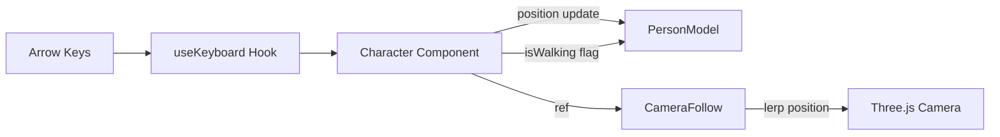

# MMORPG Character Movement — Walkthrough

## What Was Built

Arrow-key controlled character movement with walk animation, smooth rotation, and a third-person follow camera.

## Files Created/Modified

| File | Action | Purpose |
|------|--------|---------|
| [useKeyboard.ts](file:///Users/antikode/Projects/Antikode/OKR/3d-person-animated/src/hooks/useKeyboard.ts) | **NEW** | Tracks arrow key state via `keydown`/`keyup` listeners |
| [Character.tsx](file:///Users/antikode/Projects/Antikode/OKR/3d-person-animated/src/components/Character.tsx) | **NEW** | Movement controller — updates position, rotation, and animation each frame |
| [CameraFollow.tsx](file:///Users/antikode/Projects/Antikode/OKR/3d-person-animated/src/components/CameraFollow.tsx) | **NEW** | Smooth third-person camera that follows behind/above the character |
| [Scene.tsx](file:///Users/antikode/Projects/Antikode/OKR/3d-person-animated/src/components/Scene.tsx) | **MODIFIED** | Wired new components, added grid overlay, expanded ground to 50×50 |

## How It Works

- **Movement**: Direction vector from active keys → normalized → applied at 3 units/sec
- **Rotation**: `atan2` of movement vector, smoothly interpolated with angle wrapping
- **Animation**: `isWalking` toggles between `walk` and `wait` animations (already built into [PersonModel](file:///Users/antikode/Projects/Antikode/OKR/3d-person-animated/src/components/PersonModel.tsx#57-161))
- **Camera**: Lerps to offset `[0, 4, 8]` behind character, looks at character position

## How to Test

Open `http://localhost:3000` and use:
- **↑ ↓ ← →** to walk in any direction
- **Two keys** simultaneously for diagonal movement
- Release all keys → character returns to idle animation

